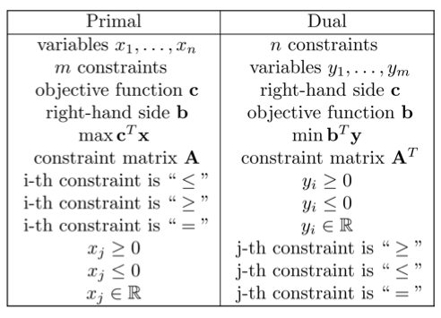

VE477

Lab8

Wang Yichao

ID: 517370910011

Ex. 1 

1. What is linear programming?

   LP is some algorithms to solve LP problems, where LP problems means that we are given an objective linear function and some constrains that are either equalities or inequalities, and we need to maximize or minimize the objective linear function when following the constrains.But we still have difficulty when solving integer LP, a special form of LP, .

2. Provide examples of situations where linear programming is used in practice.

   Since LP can be solved within polynomial time (in python, we use Gurobi optimization), if we can transform real life problem into LP, life will be easier. In business, we use LP to maximize the profit when we need to sell different sorts of products and at various prices. Another usage of LP would be airline arrangement, where we need to maximize the number of flights that can be arranged given the number of crew members and other constrains like transportation flow limits. LP can also be used for designing approximation algorithms aiming at NP-complete problems.

3. What are the standard and slack forms and how good are they to express a linear program?

   Standard form is that given n real numbers $c_1, \cdots, c_n$, m real numbers $b_0, \cdots, b_m$, $mn$ real coefficients $a_{11}, \cdots, a_{mn}$, we need to find n real numbers $x_1, \cdots, x_n$, such that $\sum_{j=1}^{n} c_{j} x_{j}$ is maximized. There should be  m constrains that $\sum_{j=1}^{n} a_{ij} x_{j} \leq b_i$ (inequalities) , and n constrains that $x_{j} \geq 0$.

   For slack form we need to introduce new variable m and rewrite the less or equal inequation into $m = RHS - LHS$. For the terms f that we need to maximize, just introduce z and rewrite it into z = f.  Notice that we do not need the nonnegative constrains $x_{j} \geq 0$ any more. 

   Standard form focus on inequations and less variables while slack form focus on equations and more variables. In this way, we can apply simplex method to solve it. 

4. What algorithms exist to solve linear programs? Provide a simple but clear description of the simplex method.

   There are three common algorithms for LP. Ellipsoid algorithm can solve LP in polynomial time, very common in theoretical purposes. Interior-point methods are actually a class of algorithms that can solve LP in polynomial time. Simplex and its variants all have exponential complexity, but they are fast in practice and are most often used.

   In simplex method, we first transform the LP problem into slack form. Then we represent the terms with positive coefficients by other variables one by one such that the increase of this term will not lead to negative variables. Then we rewrite the equations according to the representation of this term. We stop when all the coefficients are zero or negative. Then we set them to 0 and the constant number is the answer. For example, in Ex2, we choose $x_1$, $x_3$, $x_2$ to be represented. Take $x_1$ as an example, $9 - x_6/4$ means that  it can only be set as this to fulfill the nonnegative constrain. We need to compare the increasing rate of $x_1$ with other variables $x_3$, $x_2$. This process is similar when we represent $x_3$, $x_2$. We end when all the coefficients in the equation of z are negative, then we set $x_3 = x_5 =x_6 = 0$ and calculate $x_1 = 8$, $x_2 = 4$, $x_4 = 18$. The maximum z is 28. Note that this variable elimination is time consuming.

5. What is duality and when could it be applied when running the simplex method?

   We can transform primal LP to its dual. To find dual, we need to introduce dual variables. Here is some tips for transform. Variables become constraints, and vice versa. Objective function become RHS, and vice versa. Max will become min. The complete tips can be seen below. 

   

   This the cheating sheet on VG441 Supply Chain Management lecture slides, whose author is professor Shi Cong.

   For example we can transform 

   $\begin{array}{ll}\max & x_{1}+x_{2} \\ \text { s.t. } & 4 x_{1}+x_{2} \leq 2 \\ & x_{1}+2 x_{2} \leq 1 \\ & x_{1}, x_{2} \geq 0\end{array}$

   into 

   $\begin{array}{ll}\min & 2 y_{1}+y_{2} \\ \text { s.t. } & 4 y_{1}+y_{2} \leq 1 \\ & y_{1}+2 y_{2} \leq 1 \\ & y_{1}, y_{2} \geq 0\end{array}$

   Dual can be applied when we need to lower down the time complexity. Since the time complexity of LP is dependent on both the number of variables and number of constraints(not interchangeable). By dual, we can lower down the complexity. Another advantage would be that the dual form can provide an upper bound for the maximum value we need to derive in the primal. 

Ex2. 

1. (a) We need three steps. First, change the minimum into maximum. Second, change the equation into two less or equal stuff. Last, change the unconstrained variable $x_2$ into $x_3-x_4$. 

   The final result is:

   We need to maximize the $2x_1-3x_3+3x_4$, 

   Constrains are: 

   $-x_1-x_3+x_4\leq -7$

   $x_1+x_3-x_4\leq 7$

   $x_1-2x_3+2x_4\leq 4$

   $x_1, x_3. x_4 \ge 0$

   (b) Just introduce additional variables.

   We can write it as:

   $z = 2x_1 - 3x_3 + 3x_4$

   $x_5 = -7 + x_1 + x_3 - x_4$

   $x_6 = 7 - x_1 - x_3 + x_4$

   $x_7 = 4 - x_1 + 2x_3 - 2x_4$

2. The basic solution is (0, 0, 0, 30, 24, 36). 

   We can start from the fastest variable $x_1$ and set $x_1 = 9 - \frac{x_2}{4} - \frac{x_3}{2} - \frac{x_6}{4}$, 

   Then express $z$, $x_4$ and $x_5$ as $z = 27 + \frac{x_2}{4} + \frac{x_3}{2} - \frac{3x_6}{4}$ $x_4=21-\frac{3 x_2}{4}-\frac{5 x_3}{2}+\frac{x_6}{4}$ and  $x_5=6-\frac{3 x_2}{2}-4x_3 + \frac{x_6}{2}$.

   Continue with $x_3$ and $x_2$ until the terms in z are negative, we will get the final result: 

   $\begin{aligned} z &=28-\frac{x_{3}}{6}-\frac{x_{5}}{6}-\frac{2 x_{6}}{6} \\ x_{1} &=8+\frac{x_{3}}{6}+\frac{x_{5}}{6}-\frac{x_{6}}{3} \\ x_{2} &=4-\frac{8 x_{3}}{3}-\frac{2 x_{5}}{3}+\frac{x_{6}}{3} \\ x_{4} &=18-\frac{x_{3}}{2}+\frac{x_{5}}{2} \end{aligned}$

   So the maximum is 28, this is achieved when the x variables are (8, 4, 0, 18, 0, 0).

